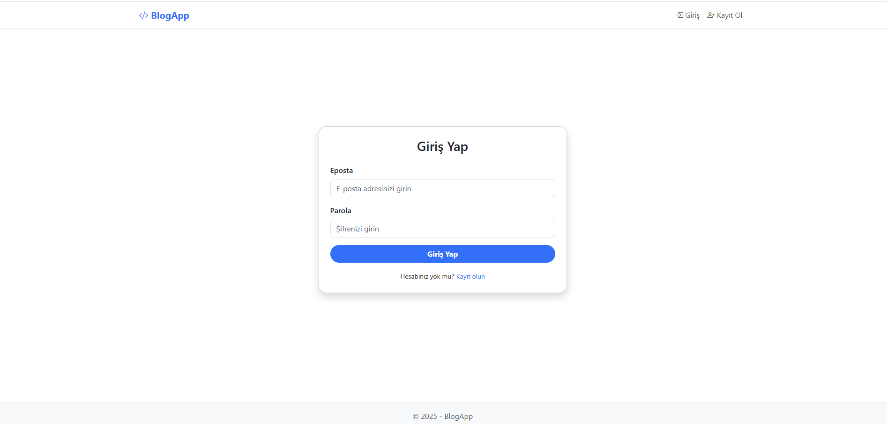
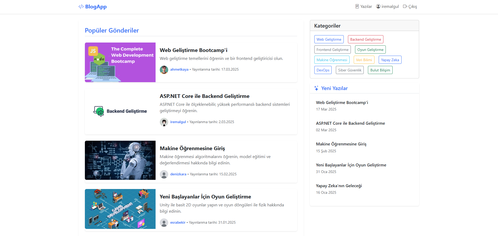
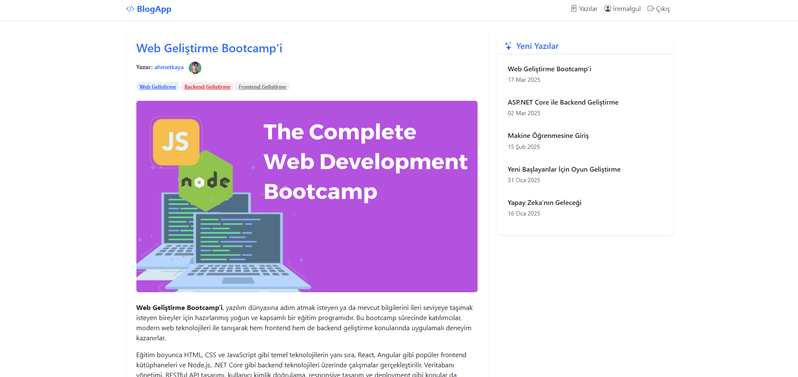
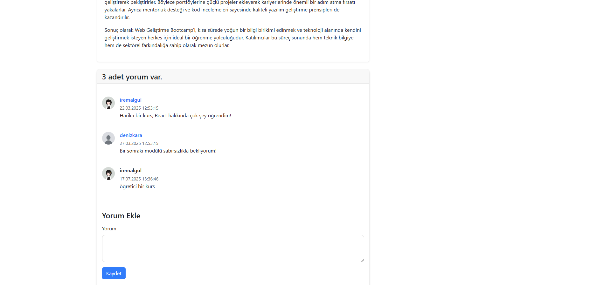
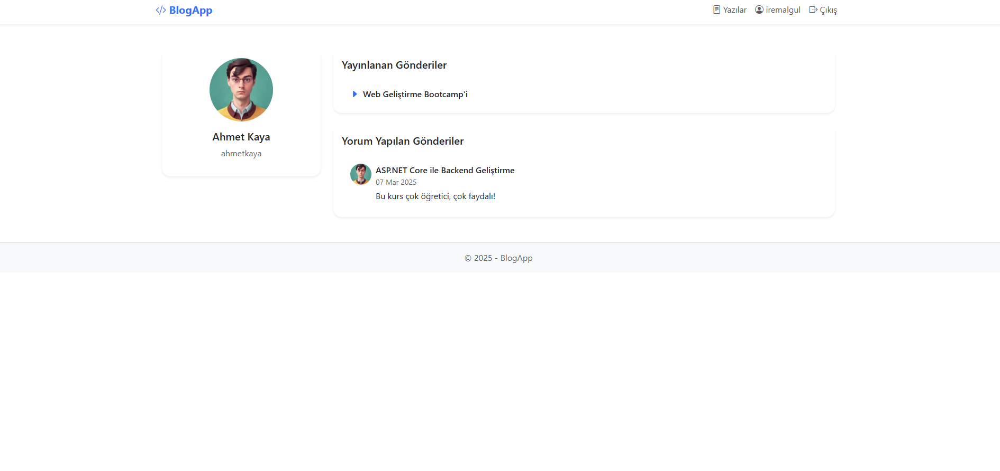
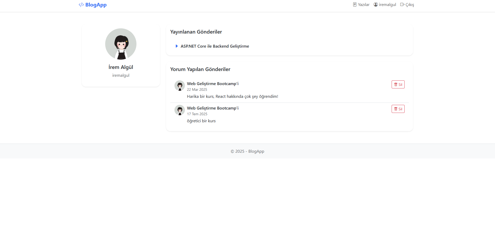
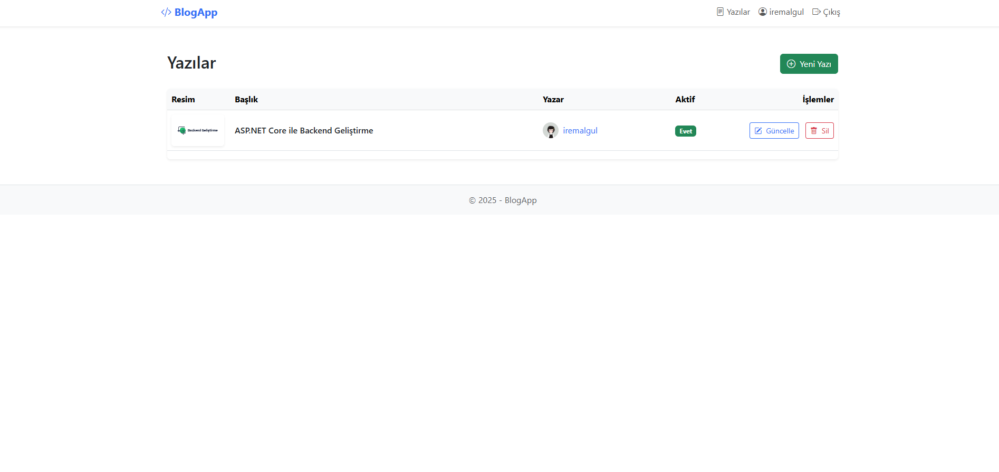
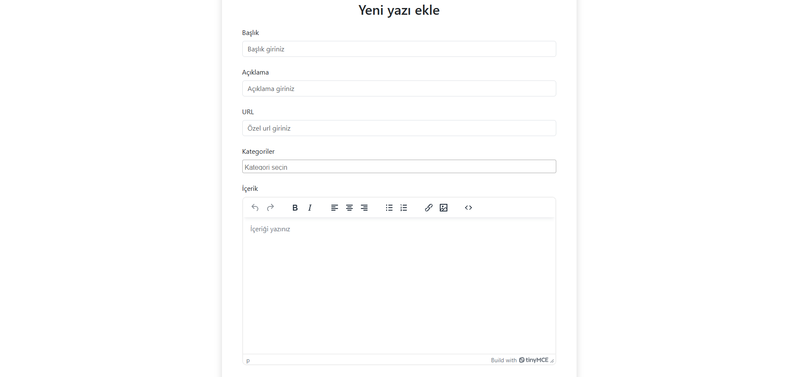
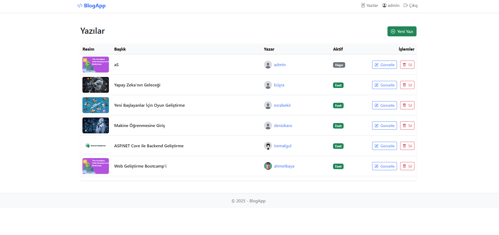
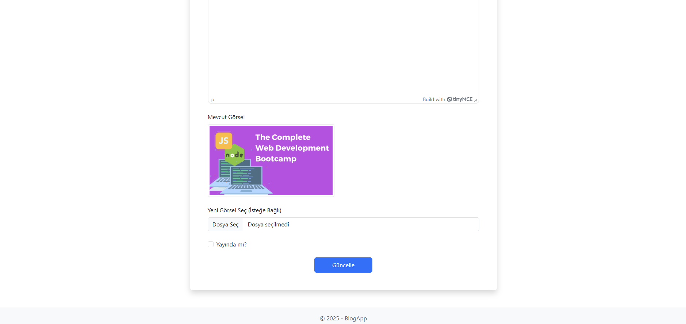

# BlogAppMVC

### 📸 Proje Tanıtım  Görselleri

  
  
  
  
  
  
  
  
  

## Proje Özeti

Bu proje, .NET Core MVC ve Entity Framework Core kullanarak geliştirilmiş bir blog sitesidir. Kullanıcılar kayıt olabilir, giriş yapabilir, blog yazıları oluşturabilir ve bu yazılar üzerinde CRUD işlemleri yapabilir. Blog yazıları başlık, içerik, yazar, yayınlanma tarihi, kategori ve opsiyonel görsel içerir. Sadece giriş yapan kullanıcılar yeni blog yazıları oluşturabilir, düzenleyebilir ve silebilir.

### Ana Özellikler:
- **Kullanıcı Yönetimi**: Kullanıcılar sisteme kayıt olabilir, giriş yapabilir ve çıkış yapabilir. Giriş yapan kullanıcılar blog yazısı oluşturabilir ve düzenleyebilir.
- **Blog Yönetimi**: Blog yazıları için başlık, içerik, yazar, yayınlanma tarihi, kategori ve görsel eklenebilir. Kategoriler ile filtreleme yapılabilir.
- **Veri Tabanı**: Entity Framework Core ve MsSQL kullanılarak veri tabanı oluşturulmuştur. Migrations ile veri tabanı yönetilmiştir.
- **Tasarım**: Bootstrap ile responsive tasarım yapılmış, Razor Pages ve Partial Views kullanılarak şablonlar oluşturulmuştur.
- **Ajax ile Post Silme**: Blog yazıları Ajax ile silinebilir.
- **TinyMCE**: Blog yazıları için TinyMCE ile gelişmiş metin düzenleme yapılabilir.
- **Profil Sayfası ve Yorumlar**: Kullanıcılar yorum bırakabilir. Yorumlar sadece giriş yapan kullanıcılar tarafından yapılabilir. Yorumlar Ajax ile silinebilir ve profil sayfasında listeleme yapılır.
- **Post ve User Resim Eklemek**: Post ve kullanıcılar için resim eklenebilir. Resimler dosya yolu kullanılarak veritabanında tutulur.
- **Pagination**: Blog yazılarında sayfalama (pagination) desteği sağlanmıştır.

### Kullanılan Teknolojiler:
- ASP.NET Core MVC
- Entity Framework Core
- MsSQL
- Bootstrap
- LibMan (Client Packages)
- SOLID prensipleri
- Dependency Injection & Repository Pattern
- TinyMCE (Metin Düzenleyici)

## Projeyi Çalıştırma:
1. **Projeyi Klonla**: `git clone https://github.com/iremalgul/BlogAppMVC.git`
2. **Paketleri Yükle**: `dotnet restore`
3. **Veri Tabanı Migrations**: `dotnet ef database update`
4. **Projeyi Başlat**: `dotnet run`

[Proje GitHub Linki](https://github.com/iremalgul/BlogAppMVC)
